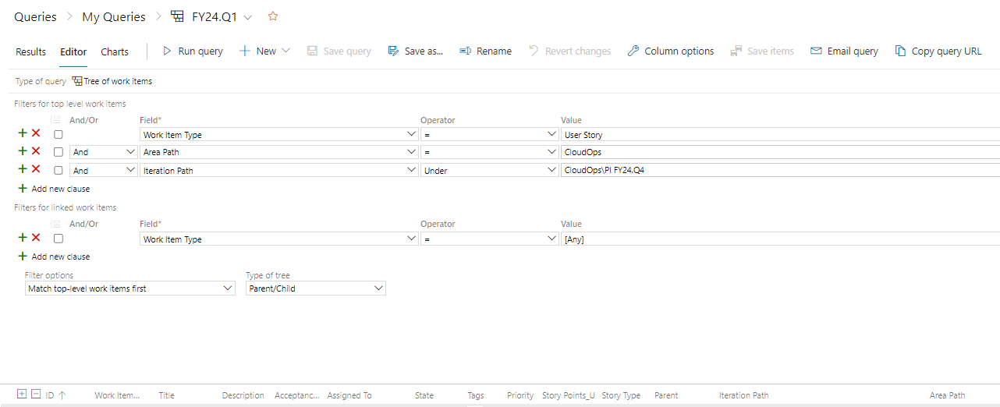
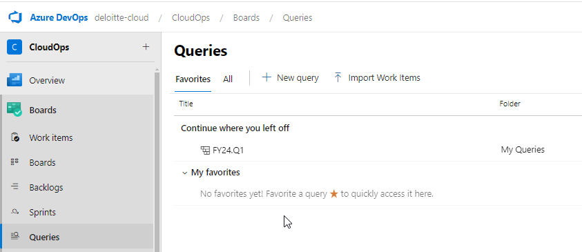
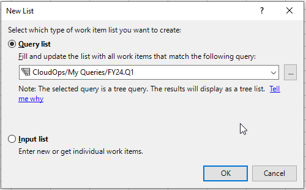
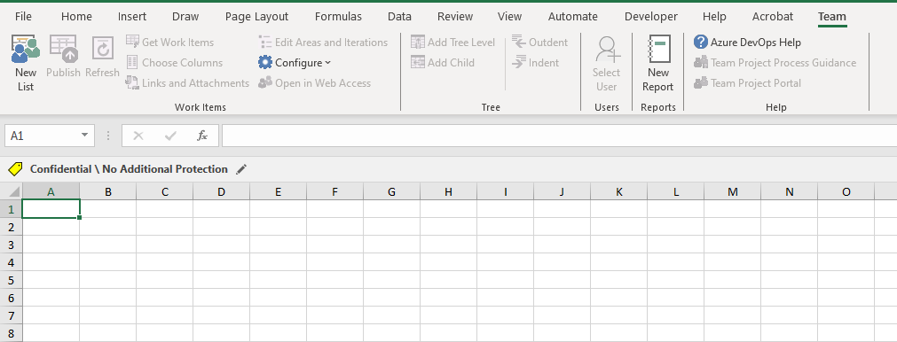
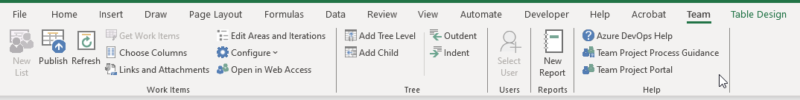
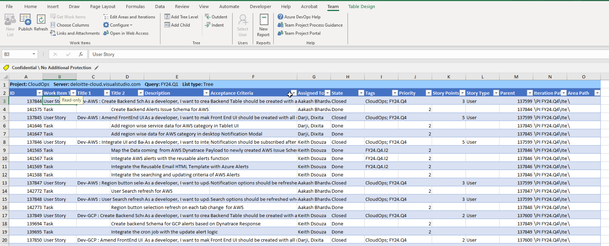
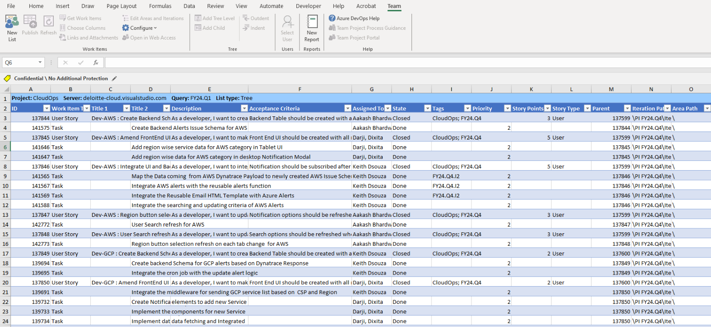

Excel to ADO Automation 

 

Step 1: Install Azure DevOps Office® Integration 2019 

 

* Go to Visual Studio Downloads and Download Azure DevOps Office Integration 2019.  

 

 

 

* Install the Software at your machine. 

* Restarts Microsoft Excel and Now, you can see another tab in Excel as “Team”. 

  

 

 

 

Step 2: Add a new query in ADO Board 

 

* Go to ADO Board, Click on Queries.  

 

 

 

* Click on New Query and Add the necessary fields with details. Add all necessary columns which you want to add while doing Bulk Upload. Adding an example for your reference. 

 

 

 

* Save Query with a Unique Name. This query is going to be used to integrate Excel and ADO. 

Note: Linking Parent Feature must be done manually as Features are getting hosted at different board. 

 

Step 3: Add Data into Excel 

 

* Select a cell in excel sheet and click on new list. 

 

 

 

 

* Click on the new list and select the query which has just been created. 

 

 

 

* After Clicking “Ok”, It will fetch the data in below manner based on your ADO Board status. 

At the start of PI, it opens an empty board where User Stories and tasks information can be added. Adding a below screenshot as a reference. 

 

Note: When the Board is empty at start of the PI, ID field will be empty. Work Item Type, Description, Acceptance Criteria and other fields need to be filled. After Clicking on Publish, the Id field will get populated. 

 

 

 

 

 

 

 

 

* Make the changes into the Excel sheet as you want and then Click on Publish. 

 

 

 

